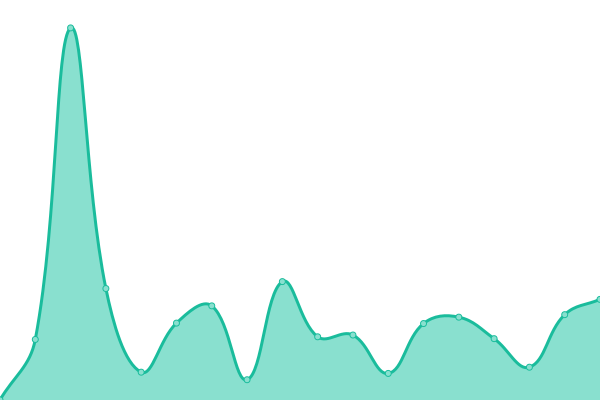

# [📈 Live Status](https://josmiguel92.github.io/upptime): <!--live status--> **🟩 All systems operational**

This repository contains the open-source uptime monitor and status page for [Josué](habanatech.com), powered by [Upptime](https://github.com/upptime/upptime).

With [Upptime](https://upptime.js.org), you can get your own unlimited and free uptime monitor and status page, powered entirely by a GitHub repository. We use [Issues](https://github.com/josmiguel92/upptime/issues) as incident reports, [Actions](https://github.com/josmiguel92/upptime/actions) as uptime monitors, and [Pages](https://josmiguel92.github.io/upptime) for the status page.

<!--start: status pages-->
<!-- This summary is generated by Upptime (https://github.com/upptime/upptime) -->
<!-- Do not edit this manually, your changes will be overwritten -->
<!-- prettier-ignore -->
| URL | Status | History | Response Time | Uptime |
| --- | ------ | ------- | ------------- | ------ |
|  [Taxidrivers Cuba](https://taxidriverscuba.com) | 🟩 Up | [taxidrivers-cuba.yml](https://github.com/josmiguel92/upptime/commits/HEAD/history/taxidrivers-cuba.yml) | 

 831ms
     
 | 

<a href="https://josmiguel92.github.io/upptime/history/taxidrivers-cuba">100.00%</a>
    

|  [Viñales.taxi](https://vinales.taxi) | 🟩 Up | [vinales-taxi.yml](https://github.com/josmiguel92/upptime/commits/HEAD/history/vinales-taxi.yml) | 

 479ms
     
 | 

<a href="https://josmiguel92.github.io/upptime/history/vinales-taxi">100.00%</a>
    

|  [AlTaxi](https://altaxi.app) | 🟩 Up | [al-taxi.yml](https://github.com/josmiguel92/upptime/commits/HEAD/history/al-taxi.yml) | 

 595ms
     
 | 

<a href="https://josmiguel92.github.io/upptime/history/al-taxi">100.00%</a>
    

|  [SensesofCuba](https://sensesofcuba.com) | 🟩 Up | [sensesof-cuba.yml](https://github.com/josmiguel92/upptime/commits/HEAD/history/sensesof-cuba.yml) | 

 1735ms
     
 | 

<a href="https://josmiguel92.github.io/upptime/history/sensesof-cuba">100.00%</a>
    

|  [Infonet-SensesofCuba](https://infonet.sensesofcuba.com) | 🟩 Up | [infonet-sensesof-cuba.yml](https://github.com/josmiguel92/upptime/commits/HEAD/history/infonet-sensesof-cuba.yml) | 

 525ms
     
 | 

<a href="https://josmiguel92.github.io/upptime/history/infonet-sensesof-cuba">100.00%</a>
    

|  [Festival de Poesia](https://festivaldepoesiadelahabana.com/) | 🟩 Up | [festival-de-poesia.yml](https://github.com/josmiguel92/upptime/commits/HEAD/history/festival-de-poesia.yml) | 

 1806ms
     
 | 

<a href="https://josmiguel92.github.io/upptime/history/festival-de-poesia">100.00%</a>
    

<!--end: status pages-->

[**Visit our status website →**](https://josmiguel92.github.io/upptime)

## 📄 License

- Powered by: [Upptime](https://github.com/upptime/upptime)
- Code: [MIT](./LICENSE) © [Josué](habanatech.com)
- Data in the `./history` directory: [Open Database License](https://opendatacommons.org/licenses/odbl/1-0/)
